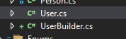

<p align="center">
  
</p>

<h2 align="center">
Class Builder Generator
</h2>

<p align="center">
  This is the official repository of <b>Class Builder Generator</b>! Fell free to add issues and give suggestions!
</p>

<p align="center">
  Don't you know what I'm talking about? Access this <a href="https://marketplace.visualstudio.com/items?itemName=JoseFelipeBlumAraujo.ClassBuilderGenerator" rel="noopener noreferrer" target="_blank">link</a> and enjoy!
</p>

### Topics
- [How to use](#how-to-use)
- [Attention](#attention)
- [Configurations](#configurations)
  - [Generator - Behavior for missing properties](#generator---behavior-for-missing-properties)
  - [Generator - Generate summary information](#generator---generate-summary-information)
  - [Generator - With method generator handler](#generator---with-method-generator-handler)
  - [Generator - Generate With method for collections](#generator---generate-with-method-for-collections)
  - [Lists - Generate WithItem method](#lists---generate-withitem-method)
- [Release notes](#release-notes)  

<br/>

### How to use

You're coding your unit tests and wants an easy and intelligent way to create the tests. To do this you have found the Builder Pattern.

So let's suppose there is the class below:

```c#
public class User
{
    public Guid Id { get; set; }
    public string Login { get; set; }
    public string Email { get; set; }
    public string Password { get; set; }
    public DateTime LastLogin { get; set; }
    public List<DateTime> LoginHistory { get; set; }
}
```

And now you want to create a builder from `User` class.

Just right click on class and select `Run Class Builder Generator`:


The builder from `User` class will be generated at the same directory of base class and will have the word `Builder` added to the file name:



Done, now you can use your brand new builder generated in less than 1 second.

<br/>

---

### Attention

If a builder with the same name already exists in the directory, a confirmation message will appears:


Pressing `Yes` the file will be **completely overwritten**.

---

### Configurations

There are some settings that can change how the builders are generated. Go to Tools > Options > Class Builder Generator:


Before we detail the settings, there is a behavior that will always be performed by the generator. When the base class has more than one constructors, a window will appear asking you to choose one of these constructors:

```c#
public User(Guid id)
{
    Id = id;
}

public User(string login, string email, string password)
{
    Login = login;
    Email = email;
    Password = password;
}
```


Selecting a constructor will define how the **Build** method will be generated:

```c#
public User Build()
{
    return new User(id);
}
```

If the selected constructor has properties that are not from the base class (it can be an inheritance for example), another window will appear asking you to choose something to be done with the properties that do not belong to the base class (this behavior can be controlled by a configuration):

```c#
public User(Guid personId)
{
    PersonId = personId;
}
```


Selecting the option **Force creation of missing properties** will generate the missing properties and the With methods into the builder:

```c#
private Guid personId;

public UserBuilder WithPersonId(Guid personId)
{
  this.personId = personId;
  return this;
}
```

#### **Generator - Behavior for missing properties**

<p>This option configure the behavior when missing properties are detected when a custom constructor is selected.</p>

Options:
- AlwaysAskWhatToDo
- AlwaysForceCreationOfMissingProperties
- DoNothing

Explanation:

If the option **AlwaysAskWhatToDo** is selected, the generator will always ask what to do with the missing properties. However, if the option **AlwaysForceCreationOfMissingProperties** is selected, the window asking what to do will no longer appears and the missing properties will always be generated. Lastly, if the option **DoNothing** is selected, the generator will ignore the missing properties.

#### **Generator - Generate summary information**

<p>This option controls if the summary will be added to the methods.</p>

Options:
- True
- False

#### **Generator - With method generator handler**

<p>This option define how the generator should handle which 'with' method will be generated.</p>

Options:
- GenerateAllProps
- PreferConstructorProps

Explanation:

If the option **GenerateAllProps** is selected, all properties will be generated even if they are not used in the selected constructor. However, if the option **PreferConstructorProps** is selected, only the properties used in the constructor will be generated.

#### **Generator - Generate With method for collections**

<p>This option controls if the With method will be added for properties like: List, IEnumerable, Collection, ICollection and Dictionary</p>

Options:
- True
- False

#### **Lists - Generate WithItem method**

<p>This option specifies if the generator will create or not a WithItem method to add a single item into the list/collection property.</p>

Options:
- True
- False

Explanation:

If the **Generate WithItem method** is **False**, only this method will be generated:
```c#
public UserBuilder WithLoginHistory(List<DateTime> loginHistory)
{
    this.loginHistory = loginHistory;
    return this;
}
```

If the **Generate WithItem method** is **True**, this method will also be generated:
```c#
public UserBuilder WithLoginHistoryItem(DateTime item)
{
    loginHistory.Add(item);
    return this;
}
```

For dictionaries there is a unique behavior:

```c#
public UserBuilder WithDictionaryItem(int key, string value)
{
    dictionary.Add(key, value);
    return this;
}
```

Currently this behavior (WithItem) only supports properties with types: **List**, **IEnumerable**, **Collection** and **Dictionary**.

<br/>

---

### Release notes

| Version | Release date | Description |
| ------- | ------------ | ----------- |
| `1.0` | 11/05/2021 | First release |
| `1.1` | 11/06/2021 | Added some error message boxes and added file overwrite prevention without user consent  |
| `1.2` | 11/06/2021 | Added a config option to enable or disable the generation of WithItem method for List properties  |
| `1.3` | 11/08/2021 | Added intelligence in dealing with existing class constructors |
| `1.3.1` | 11/08/2021 | Fixed issue [#1](https://github.com/jfelipearaujo/ClassBuilderGeneratorTracker/issues/1) and [#2](https://github.com/jfelipearaujo/ClassBuilderGeneratorTracker/issues/2) |
| `1.3.2` | 11/08/2021 | Now through a configuration you can specify if the properties outside the chosen constructor will have their own "With" methods or not |
| `1.3.3` | 11/09/2021 | Fixed a minor bug |
| `1.4` | 11/15/2021 | Added a configurable behavior when the custom constructor selected has properties that are not exposed in the base class |
| `1.4.1` | 11/19/2021 | Fixed an issue with the namespace's properties handle and performance improved |
| `1.4.2` | 11/19/2021 | Fixed an issue with the custom namespaces collector |
| `1.4.3` | 11/19/2021 | Fixed an issue with the usings |
| `1.4.4` | 11/27/2021 | Fixed some issues and added a feature thats generate summary information for all the methods |
| `1.4.5` | 11/28/2021 | Fixed an issue with the selector of missing properties |
| `1.4.6` | 11/28/2021 | Fixed how the WithItem feature works |
| `1.5` | 02/01/2022 | Added support for VS 2022 |
| `1.5.1` | 02/02/2022 | - Added a config option to enable or disable the generation of With methods for collections <br> - Now WithItem supports types like Dictionary and Collection |

<p align="center">
<br/><br/>Did you find a <b>bug</b> or have a <b>suggestion</b> to make?<br/>Use the <b>issue tracker</b> to send all the necessary information and as soon as possible I will analyze it.<br/><br/>Thank you!
</p>
